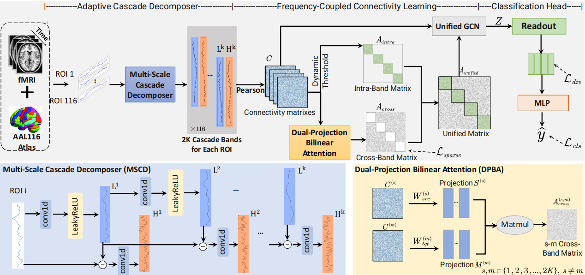

# Ada-FCN
This is the official PyTorch implementation of Ada-FCN from the paper "Ada-FCN: Adaptive Frequency-Coupled Network for fMRI-Based Brain Disorder Classification" early accepted by 28th International Conference on Medical Image Computing and Computer-Assisted Intervention (MICCAI'25).

